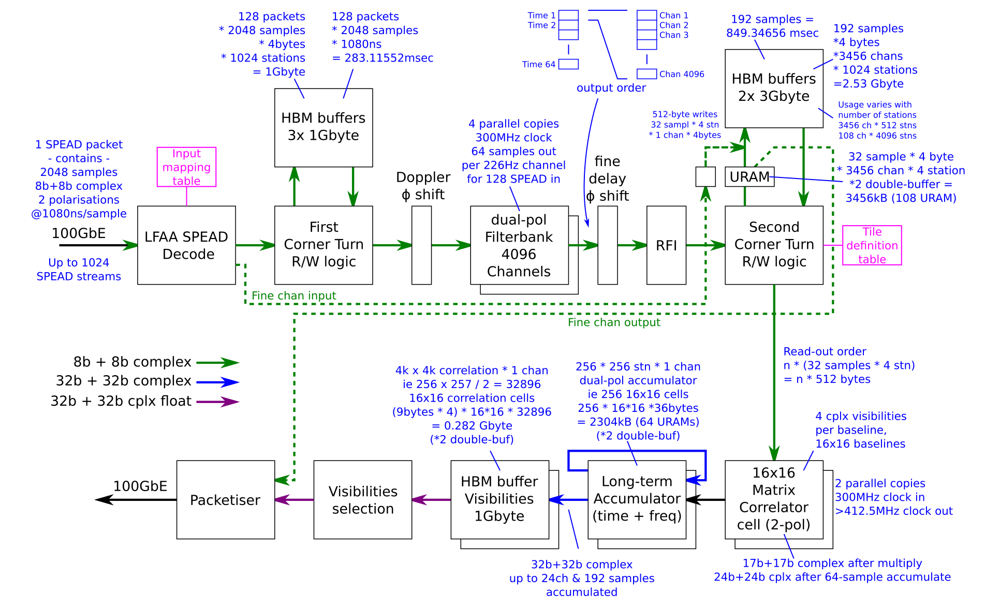

.. vim: syntax=rst

Low CBF Firmware - Correlator
=============================

This repository contains the VHDL source code to implement the 
correlator output product of Low CBF.

This document focusses on correlator-specific information, see also
`Low CBF Firmware Common <https://developer.skao.int/projects/ska-low-cbf-fw-common/en/latest/?badge=latest>`_.

Processing Modules
------------------

The processing steps are :

- Ingest from the LFAA. The LFAA ingest also includes statistics logging and the ability to generate a test data stream.
- Filterbank Corner Turn and coarse delay. To limit the overhead associated with initialising the filterbanks, a corner turn operation is required. The corner turn uses the HBM memory. The output of the corner turn is blocks samples about 283 ms long to be processed by the filterbanks.
- Correlator filterbank. 4096 point FFT, keeping the central 3456 channels. Critically sampled.
- Fine delay. Applies a phase slope to the data.
- RFI Flagging. Converts from the 16 bit real + imaginary data at the output of the filterbank to 8 bit real + imaginary.
- Correlator corner turn. This takes 283 ms blocks of data from the filterbank and fine delay processing, and outputs data with many stations for a single fine channel, for 849 ms blocks, suitable for the correlator.
- Correlator. Calculates correlations between stations. Accumulates the correlation across 64 time samples = 283 ms.
- Long Term Accumulator. Accumulates the correlator output across up to 24 fine channels, and 849 ms. Writes final visibilities to a HBM buffer.
- Correlator packetiser. Packages visibility data according to the ICD to be sent to SDP over the 100GE link.

Building Firmware
-----------------

The build process is automated via the GitLab CI/CD pipeline, and local builds
can be made `via the build.sh script in the common module <https://developer.skao.int/projects/ska-low-cbf-fw-common/en/latest/scripts.html#local-build>`_.

Configuring Firmware
--------------------

The configuration of firmware is through running firmware matlab model which is now a
submodule of firmware repo. The model can generate register configurations, stimuli for
simulation and verify the simulation result. Details about how to configure is described 
in details of the configuration process section `here <https://confluence.skatelescope.org/display/SE/Configuration+and+Simulation+instructions+of+PST>`_

Simulating Firmware
--------------------

Within firmware repo, there is a sim directory which contains the pregenerated stimuli, 
register config and vivado simulation script for gitlab CI test. Two stimulis LFAA100GE_tb_data.txt 
LFAA100GE_tb_data_lesspkt.txt are available to support long and short simulations respectively. 
These two stimuli files and register config file will be copied to vivado simulation 
directory when the simulation started. Once simulation is finished, an output file
lbus_out.txt will be generated and copied to matlab model run1/2/3/... directory for 
comparison. The above simulation process is scripted under common submodule: ./common/scripts/xsim.sh
for simulation automation.

Verifying Firmware
------------------

Within matlab model repo, matlab function rtl_model_compare is used to compare the rtl 
output and model output, rtl_model_compare(1) will trigger a long simulation verify, 
rtl_model_compare(0) will trigger a short simulation verify. Compare will generate standard
deviation between model and RTL, as the model is float point, RTL is fixed point, as long
as the stand deviation is within the specified range, then compare is regarded as passed.
Matlab script under common submodule: ./common/scripts/matlab.sh is used for the compare
automation.

The matlab compare function is calling the matlab model function run_PSTmodel which user
can refer the details of the verify process section `here <https://confluence.skatelescope.org/display/SE/Configuration+and+Simulation+instructions+of+PST>`_

